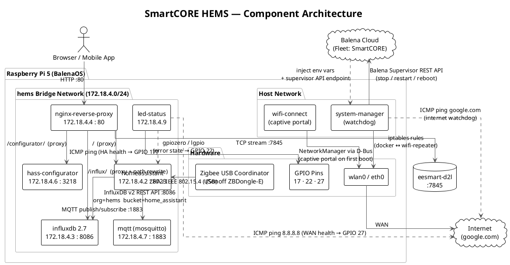
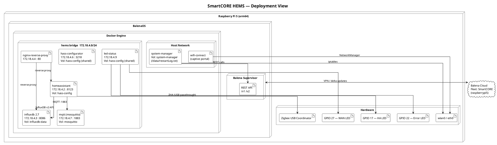
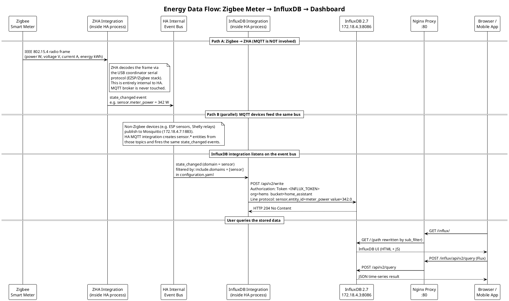

# SmartCORE HEMS — Architecture Reference

[](https://www.mtu.ie/)
[](https://smartcore.nweurope.eu/)
[](https://www.balena.io/)

This document is the primary technical reference for developers working on the SmartCORE Home Energy Management System (HEMS). It covers how the system is structured, how data flows through it, how to extend it, and what known limitations exist.

---

## Table of Contents

1. [System Overview](#1-system-overview)
2. [Component Architecture](#2-component-architecture)
3. [Deployment View](#3-deployment-view)
4. [Energy Data Flow](#4-energy-data-flow)
5. [Service Reference](#5-service-reference)
6. [Network & Routing](#6-network--routing)
7. [Environment Variables](#7-environment-variables)
8. [System-Manager Watchdog Logic](#8-system-manager-watchdog-logic)
9. [How to Extend the System](#9-how-to-extend-the-system)
10. [Accessing Home Assistant Remotely (Mobile)](#10-accessing-home-assistant-remotely-mobile)
11. [Known Gaps & Future Work](#11-known-gaps--future-work)

---

## 1. System Overview

The SmartCORE HEMS is a **containerised, self-healing energy monitoring gateway** deployed on a Raspberry Pi 5 running BalenaOS. Its purpose is to:

- **Collect** real-time energy data (power W, voltage V, current A, energy kWh) from Zigbee-based smart meters and DIN-rail monitors via a USB coordinator.
- **Store** that data as time-series measurements in InfluxDB 2.7 for historical analysis.
- **Present** a unified web UI (Home Assistant + InfluxDB dashboard) through a single Nginx reverse proxy.
- **Self-heal** automatically: restarting services on updates, rebooting the device on prolonged internet loss, and indicating health state via physical LEDs.
- **Integrate** with Balena Cloud for zero-touch remote deployment across multiple pilot sites.

The system is managed entirely through `docker-compose.yml` and deployed via `balena push`. No manual SSH is required for normal operations.

---

## 2. Component Architecture

The diagram below shows all eight services, how they relate to each other, the hardware they interact with, and the external systems they communicate with.



---

## 3. Deployment View

This diagram maps each container to its layer — from the physical hardware, through BalenaOS and Docker, up to Balena Cloud.



---

## 4. Energy Data Flow

> **Key distinction:** ZHA (Zigbee Home Automation) runs **inside** the Home Assistant process and communicates directly with the USB coordinator over serial. It does **not** route through the MQTT broker. MQTT is parallel infrastructure for non-Zigbee devices. Both paths converge at the HA internal event bus, which feeds InfluxDB.

This sequence diagram traces the complete journey of an energy measurement — from a physical Zigbee meter through to the InfluxDB UI rendered in a browser.



---

## 5. Service Reference

| Service | Image / Base | IP | Port(s) | Restart policy | Persistent volume |
|---|---|---|---|---|---|
| `homeassistant` | `homeassistant/home-assistant:2025.3` | 172.18.4.2 | 8123, 6053 | always | `hass-config → /config` |
| `influxdb` | `influxdb:2.7.1` | 172.18.4.3 | 8086 | — | `influxdb-data → /var/lib/influxdb2` |
| `nginx-reverse-proxy` | `arm64v8/nginx` | 172.18.4.4 | 80 | always | — |
| `mqtt` | `eclipse-mosquitto` | 172.18.4.7 | 1883 | always | `mosquitto → /mosquitto/data` |
| `hass-configurator` | `causticlab/hass-configurator-docker` | 172.18.4.6 | 3218 | always | shares `hass-config` |
| `led-status` | Ubuntu + gpiozero | 172.18.4.9 | — | always | shares `hass-config` (log read) |
| `system-manager` | Alpine 3 + Python 3 | host | — | on_failure | `system-manager → /data` |
| `wifi-connect` | Debian + Balena binary v4.11.84 | host | — | — | — |

### Key service interactions

- **`homeassistant` → `influxdb`:** HA's built-in InfluxDB integration sends every `sensor` domain state change to InfluxDB via the v2 HTTP API. Configured in `services/homeassistant/config/configuration.yaml`.
- **`homeassistant` → `mqtt`:** HA acts as both publisher and subscriber on the Mosquitto broker. The ZHA integration forwards Zigbee device events onto MQTT topics.
- **`nginx-reverse-proxy` → `influxdb`:** Nginx applies `sub_filter` rewriting on all HTML, CSS, and JavaScript to fix InfluxDB's hardcoded `/` base paths so the SPA works under `/influx/`.
- **`system-manager` → Balena Supervisor:** The watchdog calls the local Balena Supervisor REST API (injected at `BALENA_SUPERVISOR_ADDRESS`) to stop, restart, or reboot services without direct Docker socket access.
- **`led-status` → `homeassistant`:** The LED service shares the `hass-config` volume to read `home-assistant.log` directly and light the error LED on any `ERROR` log line.

---

## 6. Network & Routing

### Docker bridge network

All services except `system-manager` and `wifi-connect` are on the private `hems` bridge network with fixed IPs:

```
172.18.4.0/24  (gateway: 172.18.4.1)

  .2  homeassistant
  .3  influxdb
  .4  nginx-reverse-proxy
  .6  hass-configurator
  .7  mqtt
  .9  led-status
```

### Nginx routing table

| Incoming path | Upstream | Notes |
|---|---|---|
| `/` | `http://172.18.4.2:8123` | Full HA UI + WebSocket upgrade |
| `/influx/` | `http://172.18.4.3:8086` | HTML/JS path rewriting via `sub_filter` |
| `/configurator/` | `http://172.18.4.6:3218` | HASS config editor |
| TCP `:7845` (stream) | `eesmart-d2l:7845` | TCP tunnel to external energy service |

### Host-exposed ports

| Host port | Container | Purpose |
|---|---|---|
| 80 | nginx-reverse-proxy | Primary UI entry point |
| 8123 | homeassistant | Direct HA access (bypass Nginx) |
| 8086 | influxdb | Direct InfluxDB access |
| 1883 | mqtt | Zigbee2MQTT / external MQTT clients |
| 6053 | homeassistant | HA mDNS / DNS-SD |
| 3218 | hass-configurator | Direct configurator access |
| 7845 | nginx-reverse-proxy | eesmart-d2l TCP stream |

### iptables (system-manager)

`iptables.sh` runs once 180 seconds after container start and inserts a rule on `wlan0` that permits bidirectional traffic between:
- Docker network `172.18.4.0/24` (internal containers)
- WiFi repeater subnet `10.42.0.0/24` (external repeater clients)

Both `iptables` and `iptables-legacy` rules are set to cover all kernel versions on BalenaOS.

---

## 7. Environment Variables

Set these in the **Balena Cloud dashboard** under Device Variables or Fleet Variables.

| Variable | Consumed by | Required | Description |
|---|---|---|---|
| `INFLUX_TOKEN` | `homeassistant` | **Yes** | InfluxDB v2 API token. Referenced in `configuration.yaml` via `!env_var INFLUX_TOKEN`. |
| `CONFIG_USER` | `nginx-reverse-proxy` | **Yes** | Username for Nginx basic auth (generated at container start via `htpasswd`). |
| `CONFIG_PASSWORD` | `nginx-reverse-proxy` | **Yes** | Password for Nginx basic auth. |
| `BALENA_APP_NAME` | `system-manager` | **Yes** | Fleet name as shown in Balena Cloud (used to look up the `homeassistant` service release ID). |
| `BALENA_APP_ID` | `system-manager` | **Yes** | Numeric application ID from Balena Cloud (used to build supervisor API URLs). |
| `BALENA_SUPERVISOR_ADDRESS` | `system-manager` | Auto-set | Injected by BalenaOS. The local HTTP address of the Balena Supervisor (e.g. `http://127.0.0.1:48484`). |
| `BALENA_SUPERVISOR_API_KEY` | `system-manager` | Auto-set | Injected by BalenaOS. API key for the supervisor REST API. |
| `DBUS_SYSTEM_BUS_ADDRESS` | `wifi-connect` | Auto-set via label | Path to the host D-Bus socket. Set in `docker-compose.yml`. |

---

## 8. System-Manager Watchdog Logic

The `system-manager` container runs a Python watchdog loop every **30 seconds**. It communicates exclusively with the local **Balena Supervisor REST API** — it never touches the Docker socket directly.

```
┌─────────────────────────────────────────────────────────────┐
│                  watchdog.py — main loop (every 30 s)       │
├─────────────────────────────────────────────────────────────┤
│                                                             │
│  1. check_wifi_repeater_n_stop(wifi_started_at)             │
│     │                                                       │
│     ├─ GET /v2/state/status?apikey=...                      │
│     │   Find container where serviceName == "wifi-repeater" │
│     │                                                       │
│     ├─ Is it Running?                                       │
│     │   YES → record wifi_started_at (first time only)      │
│     │                                                       │
│     └─ Has it been running > 10 minutes?                    │
│         YES → POST /v2/applications/{APP_ID}/stop-service   │
│               body: {"serviceName": "wifi-repeater"}        │
│                                                             │
├─────────────────────────────────────────────────────────────┤
│                                                             │
│  2. restart_hass(version_changed_at)                        │
│     │                                                       │
│     ├─ GET /v2/applications/state?apikey=...                │
│     │   Read releaseId for "homeassistant" service          │
│     │                                                       │
│     ├─ Compare with /data/version.txt                       │
│     │                                                       │
│     ├─ Version changed?                                     │
│     │   YES → record version_changed_at                     │
│     │         Wait for 2-minute grace period                │
│     │         POST /v2/applications/{APP_ID}/restart-service│
│     │               body: {"serviceName": "homeassistant"}  │
│     │         Write new releaseId to /data/version.txt      │
│     │         Append to /data/restartLog.txt                │
│     │                                                       │
│     └─ Version same? → clear version_changed_at             │
│                                                             │
├─────────────────────────────────────────────────────────────┤
│                                                             │
│  3. check_internet(last_seen)                               │
│     │                                                       │
│     ├─ ping -c 1 google.com                                 │
│     │                                                       │
│     ├─ Success → update last_seen = now()                   │
│     │                                                       │
│     └─ Failure AND (now - last_seen) > 30 minutes?          │
│         YES → POST /v1/reboot?apikey=...                    │
│               Append to /data/restartLog.txt                │
│                                                             │
├─────────────────────────────────────────────────────────────┤
│  sleep(30)  →  repeat                                       │
└─────────────────────────────────────────────────────────────┘
```

**Persistent files (on `system-manager` volume → `/data`):**

| File | Purpose |
|---|---|
| `/data/version.txt` | Stores the last known `releaseId` of the `homeassistant` service. Compared on every loop to detect new deployments. |
| `/data/restartLog.txt` | Append-only log of all watchdog-triggered actions (HA restarts and device reboots) with timestamps. |

---

## 9. How to Extend the System

### 9.1 Add a new Zigbee device

1. **Pair the device** via the Home Assistant UI → Settings → Devices & Services → ZHA → Add Device. Put the Zigbee coordinator into pairing mode.
2. **Verify sensor entities** appear in HA (Settings → Entities). No code changes are needed — ZHA creates entities automatically.
3. **InfluxDB sync is automatic.** Because `configuration.yaml` includes all entities in the `sensor` domain, new sensor entities are written to InfluxDB as soon as they receive their first state update.
4. **Build a dashboard** in HA or query InfluxDB directly via Flux at `/influx/`.

### 9.2 Add a new container service

1. **Create the service directory** under `services/<service-name>/` with a `Dockerfile` and any required config files.

2. **Add it to `docker-compose.yml`:**

```yaml
my-new-service:
  build: ./services/my-new-service
  restart: always
  networks:
    hems:
      ipv4_address: 172.18.4.10   # pick an unused address
```

3. **Expose it through Nginx** by adding a `location` block in `services/nginx-reverse-proxy/http.conf`:

```nginx
location /my-service/ {
  set $upstream http://172.18.4.10:8080;
  proxy_pass $upstream;
  proxy_set_header Host $host;
  proxy_set_header X-Forwarded-For $proxy_add_x_forwarded_for;
}
```

4. **Deploy** with `balena push <Fleet-Name>`. Balena builds the new image and performs a rolling update.

### 9.3 Modify Nginx routing

All HTTP routing is in `services/nginx-reverse-proxy/http.conf`. TCP stream routing (for non-HTTP traffic like the eesmart-d2l proxy) is in `services/nginx-reverse-proxy/nginx.conf` under the `stream {}` block.

After any Nginx config change, redeploy with `balena push` or restart just the `nginx-reverse-proxy` service from the Balena dashboard.

### 9.4 Modify Home Assistant configuration

Two methods are available:

- **From the browser:** Navigate to `http://<device-ip>/configurator/`. This gives a full file editor over the `hass-config` volume. After saving, reload the affected config domain from HA's Developer Tools or restart HA.
- **From the repository:** Edit files under `services/homeassistant/config/`, then run `balena push`. The system-manager watchdog will detect the new `releaseId` and restart HA automatically after a 2-minute grace period.

### 9.5 Deploy changes via Balena

```bash
# From the repository root
balena push <Your-Fleet-Name>

# To target a single device instead of the whole fleet
balena push <Device-UUID>
```

Balena performs a delta-compressed update — only changed layers are transferred to the device. The `system-manager` watchdog restarts `homeassistant` automatically when it detects a new `releaseId`, so no manual intervention is needed after a push.

---

## 10. Accessing Home Assistant Remotely (Mobile)

By default, HA is only accessible on the **local network** where the Raspberry Pi is connected. To use the official **Home Assistant mobile app** (iOS / Android) from an external network, one of the following approaches must be configured.

### Option A — Nabu Casa (Home Assistant Cloud) ✅ Recommended

This is the official, zero-configuration solution built into Home Assistant. It requires a paid Nabu Casa subscription (~$7/month) but needs no router changes or extra containers.

1. In the HA UI go to **Settings → Home Assistant Cloud**.
2. Sign in or create a Nabu Casa account.
3. Enable **Remote UI**.
4. In the mobile app, enter your Nabu Casa credentials. The app discovers the remote URL automatically.

**Pros:** Works behind NAT, no port forwarding, encrypted, supported by the HA project.
**Cons:** Subscription cost, relies on Nabu Casa infrastructure.

### Option B — Tailscale (Zero-config VPN)

Tailscale creates a secure peer-to-peer VPN between your phone and the Raspberry Pi without any port forwarding or public IP.

1. Add a `tailscale` service to `docker-compose.yml`:

```yaml
tailscale:
  image: tailscale/tailscale:latest
  network_mode: host
  cap_add:
    - NET_ADMIN
    - SYS_MODULE
  volumes:
    - /var/lib/tailscale:/var/lib/tailscale
  environment:
    - TS_AUTHKEY=<your-tailscale-auth-key>
    - TS_EXTRA_ARGS=--advertise-routes=172.18.4.0/24
```

2. Install Tailscale on your phone and log in with the same account.
3. In the HA mobile app, use the Tailscale IP (e.g. `http://100.x.x.x:8123`) as the internal URL.

**Pros:** Free tier available, no port forwarding, works on all networks, end-to-end encrypted.
**Cons:** Both devices must have Tailscale installed and be logged into the same account.

### Option C — Cloudflare Tunnel

Routes traffic from a public `*.trycloudflare.com` (or custom) domain to your Raspberry Pi without opening any inbound ports.

1. Create a Cloudflare account and install `cloudflared` as a new container:

```yaml
cloudflare-tunnel:
  image: cloudflare/cloudflared:latest
  command: tunnel --no-autoupdate run
  environment:
    - TUNNEL_TOKEN=<your-tunnel-token>
  restart: always
  networks:
    hems:
      ipv4_address: 172.18.4.11
```

2. Map the tunnel to `http://172.18.4.2:8123` in the Cloudflare dashboard.
3. Use the resulting public HTTPS URL in the HA mobile app.
4. Set the domain in HA's `http:` config under `trusted_proxies` to include Cloudflare's IP ranges.

**Pros:** Free, HTTPS out of the box, custom domain support.
**Cons:** Traffic routes via Cloudflare's infrastructure; slightly more complex setup.

### Option D — Port forwarding (direct, not recommended)

Forward port 8123 on your router to the Raspberry Pi's local IP. Then use `http://<your-public-ip>:8123` in the mobile app.

**Pros:** Simplest network setup.
**Cons:** Exposes HA directly to the internet. HTTPS must be manually configured. The current setup has no TLS — this is a known gap (see [Section 11](#11-known-gaps--future-work)). Not recommended without TLS.

---

## 11. Known Gaps & Future Work

### 11.1 No TLS / HTTPS

**Current state:** All traffic between containers and between the browser and Nginx is plain HTTP. The Nginx proxy listens on port 80 only.

**Risk:** Credentials (`INFLUX_TOKEN`, basic auth) and energy data are transmitted in cleartext on the local network.

**Recommended fix:** Add an SSL termination layer at Nginx. Options include:
- A self-signed certificate (acceptable for LAN-only deployments)
- Let's Encrypt via `certbot` (requires a public domain name)
- A Cloudflare-proxied tunnel (handles TLS externally — see Section 10)

### 11.2 MQTT broker allows anonymous connections

**Current state:** `mosquitto.conf` contains `allow_anonymous true`. Any device on the `hems` network (or with access to port 1883) can publish or subscribe to any topic without credentials.

**Risk:** A compromised container could inject false energy readings or subscribe to all telemetry.

**Recommended fix:**
- Set `allow_anonymous false` in `mosquitto.conf`
- Create a password file (`mosquitto_passwd`) with credentials for HA
- Update the HA MQTT integration config to include `username` and `password`

### 11.3 Multi-site fleet scaling

**Current state:** Each Raspberry Pi runs as an independent Balena device. Environment variables (`INFLUX_TOKEN`, etc.) must be set per-device or applied fleet-wide.

**Considerations for scaling:**
- Use Balena **Fleet Variables** for shared config and **Device Variables** to override per-site
- Each device writes to its own InfluxDB instance — there is currently no centralised data aggregation
- For a central data lake, a cloud-hosted InfluxDB (or other TSDB) could be used as a secondary write target from HA

### 11.4 External energy service integration (eesmart-d2l)

**Current state:** Nginx has a TCP stream proxy on port 7845 forwarding to `eesmart-d2l:7845`. The service name `eesmart-d2l` is resolved via Docker DNS, implying a container by that name is expected on the host or network — but no such container is defined in `docker-compose.yml`.

**Action required:** The `eesmart-d2l` service definition is missing. Either:
- Add the container to `docker-compose.yml` and connect it to the `hems` network, or
- Replace the DNS name with an external IP/hostname if it is a remote service

This is currently a broken proxy route and should be resolved before production deployment.

---

*Generated from codebase analysis — last updated 2026-02-24.*
*Maintained by the SmartCORE Ireland team, Munster Technological University.*
